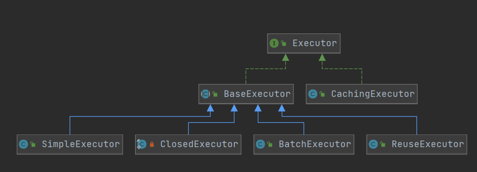

# source-read

这个目录下的markdown文件是全是源码阅读相关的。

# 源码阅读之道

mybatis的整体架构应该是怎样的呢？其核心功能的实现方式是怎样？如何对mybatis进行定制？如何对其核心组成部分是怎样？这是我们阅读源码后必须要解答的问题，否则那源码阅读是无用的。

我们阅读源码，一开始要从宏观看整个项目，先把握住主干，千万不能上来啥也不明白就开始追求细节，这样的话格局就小了，正如画画，要先有个宏观构想，再逐步细化。我们要读出其设计理念、设计思想。 核心的类有哪些？其承载着什么功能呢？

mybatis阅读源码比较好的一点是其测试非常齐全，非常适合用来研究、debug，clone下来即可运行。

mybatis的插件体系涉及的核心类是：
Executor、ParameterHandler、ResultSetHandler、StatementHandler

mybatis最有价值的是什么呢？考虑我们如果想实现一款orm框架，那么它的核心有哪些呢？一个orm框架核心的应该是其如何对java对象于数据库表进行映射的？这才是其最核心的。至于插件体系、配置解析、日志打印、，这种应该是次要的，像缓存这种属于细节。

# 核心组成：
### SqlSession
负责暴露给外部执行sql，可以配置多种执行方式，代表一个数据库会话，其通过Configuration类获取当前的配置信息。
默认是用DefaultSqlSession

### Executor
执行器，

### StatementHandler

### ResultSetHandler

### ParameterHandler

# 流程分析

1. 如何根据mapper从而执行相应的sql

## 非核心

1. 其缓存是如何使用的

# 核心类

1. SqlSession、DefaultSqlSession
1. MapperMethod
1. MappedStatement 
1. MapperProxy 每个mapper都会有对应的
1. MapperProxyFactory 每个mapper都会有对应的
1. 
